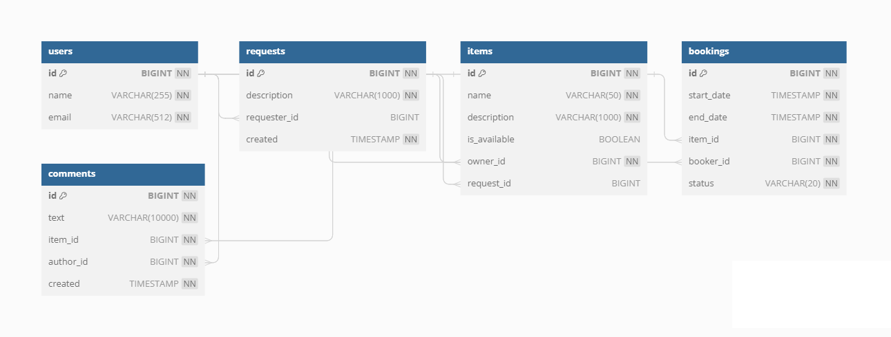

# java-ShareIt

An online platform for renting(sharing) items.

### Stack
- Java 11
- Spring Boot
- Hibernate
- Lombok
- Maven
- Junit
- PostgreSQL
- REST
- Docker

### Functions:
- Creating new users, updating data.
- Creating, deleting, editing, and booking items.
- Searching for items using text.
- Approval or rejection of rental requests by the owner.
- Retrieval of a user's list of all bookings.
- Retrieval of a list of all bookings for items owned by the user.
- Retrieval of a user's list of all items.
- Posting reviews for items.

- ## Main Service Database Structure:

